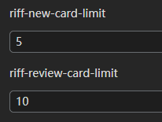

# FAQ

## How does SiYuan store data?

The data is saved in the workspace[^1] folder, in the workspace/data/ folder:

- ​`assets` is used to save all inserted assets[^2]
- ​`emojis` is used to save emoji images
- ​`snippets` is used to save code snippets
- ​`storage` is used to save query conditions, layouts and flashcards[^4], etc.
- ​`templates` is used to save template snippets[^5]
- ​`widgets` is used to save widgets[^6]
- ​`plugins` is used to save plugins[^7]
- ​`public` is used to save public data
- The rest of the folders are the notebook folders created by the user, files with the suffix of `.sy`​​​ in the notebook folder are used to save the document data, and the data format is JSON

## Does it support data synchronization through a third-party sync disk?

Data synchronization through third-party synchronization disks is not supported, otherwise data may be corrupted. 

Although it does not support third-party sync disks, it supports Connect with third-party cloud storage[^8].

In addition, you can also consider manually exporting and importing data to achieve data synchronization:

- Desktop: <kbd>Settings</kbd>​ - <kbd>Export</kbd>​ - <kbd>Export Data</kbd>​ / <kbd>Import Data</kbd>​
- Mobile: <kbd>Right column</kbd> - <kbd>About</kbd> - <kbd>Export Data</kbd> / <kbd>Import Data</kbd>​

On macOS, SiYuan will access the Desktop, Documents, and iCloud drive folders to detect whether the workspace is placed under the iCloud synchronization path. Please rest assured that SiYuan will never snoop on your personal data.

## Is SiYuan open source?

SiYuan is completely open source, and the complete source code can be found on GitHub.

## How to upgrade to a new version?

- If installed via app store, please update via app store
- If it is installed through the installation package on the desktop, you can open the option of <kbd>Settings</kbd> - <kbd>About</kbd> - <kbd>Automatically download update installation package</kbd>, so that SiYuan will automatically download The latest version of the installation package and prompts to install
- If it is installed by manual installation package, please download the installation package again to install

You can <kbd>Check update</kbd> in <kbd>Settings</kbd> - <kbd>About</kbd> - <kbd>Current Version</kbd>, or pay attention to [Official website](https://b3log.org/siyuan/) to get the new version.

## What if some blocks (such as paragraph blocks in list items) cannot find the block icon?

The first sub-block under the list item is the block icon omitted. You can move the cursor into this block and trigger its block menu with <kbd>Ctrl+/</kbd> .

## What should I do if the data repo key is lost?

- If the data repo key is correctly initialized on multiple devices before, the key is the same on all devices and can be set in <kbd>Settings</kbd> - <kbd>About</kbd> - <kbd>Data repo key</kbd> - <kbd>Copy key string</kbd> retrieve
- If it has not been configured correctly before (for example, the keys on multiple devices are inconsistent) or all devices are unavailable and the key string cannot be obtained, you can reset the key by following the steps below:

  1. Manually back up the data, you can use <kbd>Export Data</kbd> or directly copy the `workspace/data/` folder on the file system
  2. <kbd>Settings</kbd> - <kbd>About</kbd> - <kbd>Data rep key</kbd> - <kbd>Reset data repo</kbd>
  3. Reinitialize the data repo key. After initializing the key on one device, other devices import the key
  4. The cloud uses the new synchronization directory, the old synchronization directory is no longer available and can be deleted
  5. The existing cloud snapshots are no longer available and can be deleted

## Do I need to pay for it?

Most features are free, even for commercial use.

Member's privileges[^10] can only be used after payment, please refer to [Pricing](https://b3log.org/siyuan/en/pricing.html).

## Origin of the name "SiYuan"

The name "SiYuan" comes from the Chinese idiom "饮水思源", which means "when drinking water, one should remember where it comes from" and is used to describe the virtues of not forgetting one's roots and gratitude.

We hope that users of SiYuan note-taking software for knowledge management will not forget the sources and connections of their knowledge, and more importantly, will not forget to contribute to society and all of humanity with what they have learned.

[^1]: # Workspace

    ## Overview

    The workspace is used to save data, history, configuration and files needed at runtime.

    - Different workspaces are isolated from each other by file system folders
    - A workspace can only be served by one kernel process

    ## Switch workspace

    - On the desktop, multiple workspaces can be opened in the drop-down menu on the left side of the top bar

      If your multiple workspaces need to be started frequently, you can consider creating a different startup entry for each workspace and specify the startup parameter `--workspace="Absolute-path-of-the-workspace"`(Please use `"` to enclose the path). For example, multiple shortcuts can be copied on a Windows system, and each Shortcut - Property - Target is followed by a workspace path parameter, such as `--workspace="F:\SiYuan"`. In addition, you can also pass `--port=12345` to specify the port that the kernel listens to.
    - On the mobile, we can switch between different workspaces in <kbd>About</kbd> in the right colum panel

    ## File system structure

    The structure under the workspace on the file system:

    - ​`conf` is used to save the workspace configuration
    - ​`corrupted` is used to save corrupted data files
    - ​`data` is used to save data, please refer to [here](#20210428222603-moih9fe) for the specific structure
    - ​`history` is used to save file history
    - ​`repo` is used to save data warehouse data
    - ​`temp` is used to save temporary files needed at runtime
    - ​`.lock` This file will be created after the kernel process starts to lock the workspace


[^2]: # Assets

    ## Overview

    Attachments inserted through the editor will be regarded as asset files and will be placed in the `workspace/data/assets/` folder by default.

    ## Insert picture or file

    In the editor, you can directly paste the copied picture or file in the system clipboard (not supported on Linux), or insert it by dragging and dropping the picture or file into the editor. There are two options when inserting:

    - Copy as an asset and insert: Copy a picture or file as a resource file and insert, shortcut key <kbd>Ctrl</kbd>+<kbd>V</kbd>​
    - Use `file://` absolute path and link: Insert a picture or file into a hyperlink as a local absolute path, shortcut key <kbd>Ctrl</kbd>+<kbd>Shift</kbd>+<kbd>V</kbd>, or hold down <kbd>Alt</kbd> and drag in

    For pictures, if a picture title is specified during layout, the title will be rendered below the picture as a legend.

    

    ​#Note#: Inserting pictures will not be compressed, and all pictures and files will be saved as original data.  

    ## Cleanup unreferenced assets

    A "Reference" refers to a link to a asset file via a hyperlink, an inserted image, or the `src` attribute of an HTML tag (such as ``, `<iframe>`). There are two cases here:

    1. Reference to a specific asset file, such as a picture or a file
    2. Reference to a asset folder (a subfolder under the assets folder) must end with `/`, such as `[foo](assets/bar/)`. If a asset folder is referenced, all the following asset files will be counted as already referenced regardless of whether they are individually referenced

    In <kbd>Settings</kbd> - <kbd>Assets</kbd>, you can clean up unreferenced assets by one-click. If you need to retrieve files that have been deleted by mistake, please via Rollback[^3].

    ​#Note#: Using absolute paths (local or network paths) will not be included Clean up calculations.

    ## List missing assets

    You can view the missing resources in <kbd>Settings</kbd> - <kbd>Assets</kbd>, and you can find the references in the global search after copying the path.

    ​#Note#: To search asset paths, you need to enable <kbd>Settings</kbd> - <kbd>Search</kbd> - <kbd>Index</kbd> - <kbd>Asset Path</kbd>.

    ## Notebook-level assets

    If you need to place the inserted assets in the assets folder at the same level as the document by default, you need to manually create a folder named assets first, so that SiYuan will preferentially select the assets folder to store the assets.

    It is recommended not to use notebook-level assets as much as possible, as this has some side effects:

    - When deleting the doc, the assets referenced by the doc will be copied to the global assets in batches to ensure the normal operation of cross-notebook asset references
    - Does not support viewing notebook-level assets history in data history
    - Dose not support search by `/Assets`
    - Dose not support rename

    ## Image OCR to extract text

    This feature is only supported on the desktop, and the *Tesseract OCR* program needs to be manually installed first. 

    ​#Note#:

    - When installing Tesseract OCR, you need to check the language pack you need, and add the installed Tesseract-OCR directory path to the environment variable `PATH`, so that SiYuan can directly call the `tesseract` command to extract text from image OCR. If the installation is normal, you can search for `tesseract-ocr enabled` in the kernel boot log; If you want to disable OCR, set the environment variable `SIYUAN\_TESSERACT\_ENABLED=false`​
    - SiYuan does not enable all installed language packs, because too many language packs will cause OCR to be slow or even timeout and return empty results, and take up too many system resources, so by default only `eng`​, `chi*`​, `fra`​, `spa`​, `deu`​, `rus`​ and `osd`​ will be enabled at most, if you need more accurate language support, you can specify the language pack by configuring the environment variable `SIYUAN_TESSERACT_LANGS`​, such as `SIYUAN_TESSERACT_LANGS=chi_sim+eng`​
    - Only images in png and jpg formats are supported
    - By default, only images below 2MB are processed. If you need to adjust, you can set the environment variable `SIYUAN_TESSERACT_MAX_SIZE`​, the unit of value is bytes, for example: `SIYUAN_TESSERACT_MAX_SIZE=4000000`​ adjust the upper limit to 4MB

    Image OCR extracts text automatically in the background, currently only supports PNG and JPG images. The extracted text is used in the search function, so that images can be located by text keywords.

    ### Manually adjust OCR results

    The OCR results are saved in `workspace/data/assets/ocr-texts.json`, and the OCR results can be adjusted in the following ways:

    - After exiting SiYuan, modify the file on the file system (please pay attention to the correctness of the JSON format)
    - Or select <kbd>OCR</kbd> from the image element menu in the editor

    After the adjustment, you need to manually rebuild the index.


[^3]: ## Rollback through file history

    In the time list column on the left side of the data history interface, there is a rollback button on the right side of each history record. After clicking, a confirmation dialog box will pop up. If the rollback is confirmed, the existing file will be overwritten with the file history.

    If there are very many files that need to be rolled back, it is recommended to manually copy on the file system. The internal structure of the history folder is the same as the internal structure of data, for example:

    - Notebook delete: `2022-05-01-091021-delete/20210808180117-czj9bvb/`, i.e. `historical generation date-{operation}/{notebook ID}/`
    - Document deletion: `2022-05-01-091209-delete/20210808180117-czj9bvb/20200812220555-lj3enxa.sy`, which is `historical generation date-{operation}/{notebook ID}/{document path}`
    - Asset file cleanup: `2022-05-01-095621-clean/assets/image-20220501091157-qccp87e.png`, which is `historical generation date-{operation}/assets/{asset file name}`

    Manual rollback steps:

    1. Exit SiYuan, and then make a full copy and backup of the entire workspace to avoid data loss caused by subsequent misoperations
    2. Go to the `workspace/history/` folder and copy the data in the `historical generation date-{operation}` folder directly to the data folder for overwriting
    3. Reindex manually after starting SiYuan

    ### Clean up file history

    By default, the history of files generated in the last 30 days is automatically saved, which can be adjusted through <kbd>Settings</kbd> - <kbd>Editor</kbd> - <kbd>History Retention Days</kbd>. History will be automatically deleted.

    If you want to clear all file history data, you can click <kbd>Settings</kbd> - <kbd>Editor</kbd> - <kbd>Clear all history</kbd>, or manually delete the `workspace/history/` folder, then <kbd>Reindex</kbd> in <kbd>File History</kbd>.


[^4]: # Flashcards

    ## Overview

    After setting the content block as a flashcard, it will automatically arrange the review through the spaced repetition algorithm FSRS (github repo: open-spaced-repetition/free-spaced-repetition-scheduler).

    ## How to use

    ### Content Block

    Before starting the official card making, let us introduce some basic rules of card making:

    - ==mark== elements in content blocks will be treated as knockout answers
    - If a super block is set as a flashcard, the first sub-block of the super block will be regarded as a question, and the rest of the sub-blocks will be regarded as an answer
    - If a list or list item is set as a flashcard, non-sublists will be treated as questions and sublists will be treated as answers
    - If a heading block is set as a flashcard, the heading block will be treated as a question and the blocks below it will be treated answers

    The above rules can be adjusted in <kbd>Settings</kbd> - <kbd>Flashcard</kbd>.

    ### Based on doc

    The document-based usage method does not need to pay attention to the card deck, and supports parent-child document review.

    - Select <kbd>Quick make card</kbd> in the block icon menu to make a card
    - Right-click the doc in the document tree panel or click the document block icon <kbd>Flashcard</kbd> in the editor to enter the review

    ### Based on card deck

    Based on the use of card deck, the content blocks in different documents can be carded and put into a unified card pack for review.

    - Select <kbd>Add to card deck...</kbd>​ in the block label menu, and then add the content block to a card deck to complete the card making
    - Access review by clicking <kbd>Flashcard</kbd>​ in the top bar menu

    This mode of use is disabled by default. If necessary, it can be enabled in <kbd>Settings</kbd> - <kbd>Flashcard</kbd> - <kbd>Deck</kbd>. However, it is not recommended to use flashcards based on card deck, because the card deck are fixed and not as flexible as using flashcards based on documents.

    ## Settings

    You can adjust the global configuration related to flashcards in <kbd>Settings</kbd> - <kbd>Flashcard</kbd>, including <kbd>New Card Limit</kbd> and <kbd>Old Card Limit</kbd> can be overridden using document block custom attributes:

    - ​`riff-new-card-limit`​
    - ​`riff-review-card-limit`​

    

    They are configured separately on different documents and do not affect each other. For example, if the parent document is configured as 5 and the sub-document is 10, then it will be 5 when reviewing from the parent document, and the configuration of the sub-document will not be superimposed.

    ## ​#Note#​

    - After the content block is deleted (or the ID is changed), the corresponding flashcard will become invalid
    - It is not recommended to enable card decks. This method has been deprecated. If you continue to use it, you may encounter unsolvable problems

    ## Technical implementation

    - The card deck data is stored in the `workspace/data/storage/riff/` folder through the MessagePack serialization protocol
    - Load all card deck data to the memory at startup, and reload once after the data is downloaded synchronously


[^5]: # Template snippet

    ## Overview

    The template snippet is used to quickly insert the previously set text content at the cursor caret position, and it supports variables. Template snippets use `.md` suffix files and are stored in the data/templates folder of the workspace.

    ## Writing a template

    The template is implemented using [The Go Programming Language text template](https://golang.org/pkg/text/template/). If you have an understanding of this, you can implement some program logic in it, such as comparison logic , Iterative logic, etc. In addition, to avoid syntax conflicts, template syntax uses `.action{action}` (instead of `{{action}}`).

    We have built-in variables and functions to enrich the template through the open source project Sprig (GitHub repo: Masterminds/sprig). For example, you can use `.action{now | date "2006-01-02 15:04:05"}` to render the current time. For more usage, please refer to [Sprig Function Documentation](http://masterminds.github.io/sprig/).

    There is a detail about the date and time formatting. #Note#: The formatting of the Go programming language is quite special: Instead of using `yyyy-MM-dd HH:mm:ss`, use `2006-01-02 15:04: 05` This fixed time format ([related discussions on Stack Overflow](https://stackoverflow.com/questions/20530327/origin-of-mon-jan-2-150405-mst-2006-in-golang)).

    In addition to the built-in variables and functions of Sprig, the following variables and functions are also supported:

    - ​`title`: Use this variable to insert the current document name. For example, if the template content is `# .action{.title}`, it will be inserted into the current document content with the first-level heading syntax after invoking
    - ​`id`：Use this variable to insert the current document id
    - ​`name`: Use this variable to insert the current document name
    - ​`alias`：Use this variable to insert the current document alias
    - ​`getHPathByID`: This function is used to return the readable path of the block corresponding to the block ID
    - ​`queryBlocks`: This function is used to query the database, and the return value is a list of blocks

      ```
      .action{$today := now | date "20060102150405"}
      .action{$blocks := queryBlocks "SELECT * FROM blocks WHERE content LIKE '?' AND updated > '?' LIMIT ?" "%foo%" $today "3"}
      ```
    - ​`getBlock`: This function is used to query the database based on the block ID, and the return value is block

      ```
      .action{getBlock "20250331163529-vixv1we"}
      ```
    - ​`querySpans`: This function is used to query the database, and the return value is a list of spans

      ```
       .action{querySpans "SELECT * FROM spans LIMIT ?" "3"}
      ```
    - ​`querySQL`: This function is used to query the database and the return value is a result set

      ```
       .action{querySQL "SELECT * FROM refs LIMIT 3"}
      ```
    - ​`statBlock`: This function is used to count the block content

      ```
      .action{ (statBlock .id).RuneCount} .action{ (statBlock .id).WordCount}
      ```
      - RuneCount
      - WordCount
      - LinkCount
      - ImageCount
      - RefCount
      - BlockCount
    - ​`runeCount`: This function is used to return the number of characters in a string
    - ​`wordCount`: This function is used to return the number of words in a string
    - ​`parseTime`: This function is used to parse a string in time format into a `time.Time` type so that more formatting methods can be used to render the time
    - ​`Weekday`: This function is used to return the day of the week `Sunday=0, Monday=1, ..., Saturday=6`​
    - ​`WeekdayCN`: This function is used to return the day of the week `Sunday=日, Monday=一, ..., Saturday=六`​
    - ​`WeekdayCN2`: This function is used to return the day of the week `Sunday=天, Monday=一, ..., Saturday=六`​
    - ​`ISOWeek`: This function is used to return the week
    - ​`pow`: Exponential calculation, return an integer
    - ​`powf`: Exponential calculation, return a floating point number
    - ​`log`: Logarithmic calculation, returns an integer
    - ​`logf`: Logarithmic calculation, return a floating point number

    ## Invoke template

    At the cursor caret position, select the template via <kbd>/</kbd> to trigger the template search, find the template that needs to be inserted and press <kbd>Enter</kbd>.

    ## An example

    ```plaintext
    .action{$before := (div (now.Sub (toDate "2006-01-02" "2020-02-19")).Hours 24)}

    .action{$after := (div ((toDate "2006-01-02" "2048-02-19").Sub now).Hours 24)}
    Today is `.action{now | date "2006-01-02"}`.

    * `.action{$before}` days have passed since `2020-02-19`
    * There are `.action{$after}` days left from `2048-02-19`
    ```
    `$before` and `$after` define two variables to record the number of days from the current date to 2020 and 2048, respectively.

    ## Push to template marketplace

    Please refer to [Community marketplace repo](https://b3log.org/siyuan/en/community.html).

    ‍


[^6]: # Widgets

    ## Overview

    The widget is a static webpage served by SiYuan Kernel. It accesses data through API and renders it through `<iframe>`.

    Compared with plugins[^7], a widget is a kind of content block, which follows the indexing and rendering rules of the block. The widget is mainly oriented to content block extension, not to program function extension.

    ## How to use

    The widgets are installed through the widget marketplace. After installation, the widgets will be placed in the `workspace/widgets/` folder. In the editor, use the slash menu to trigger the call search. After selecting the widget you need, the widget will be inserted into the document in the form of a widget block.

    ## Push to widget marketplace

    Please refer to [Community marketplace repo](https://b3log.org/siyuan/en/community.html).


[^7]: # Plugins

    ## Overview

    Plugins are mainly used to expand the overall functions of SiYuan.

    Compared with widgets[^6], the plugin is mainly for program function extension, not for content block extension.

    ## How to use

    The plugin is installed through the plugin marketplace. After installation, the plugin will be placed in the folder `workspace/plugins/`. You can enable or disable plugins in <kbd>Settings</kbd> - <kbd>Marketplace</kbd> - <kbd>Downloaded</kbd> - <kbd>Plugin</kbd>.

    ## Push on plugin marketplace

    Please refer to [Community marketplace repo](https://b3log.org/siyuan/en/community.html).


[^8]: # Connect with third-party cloud storage

    Please configure in <kbd>Settings</kbd> - <kbd>Cloud</kbd> - <kbd>Cloud Storage Provider</kbd>, currently supported:

    - S3 compatible object storage services, such as [Qiniu](https://s.qiniu.com/VbQfeu), [Aliyun OSS](https://www.aliyun.com/product/oss?userCode=yqovuas2), [Cloudflare R2](https://www.cloudflare.com/)
    - WebDAV protocol, such as [InfiniCLOUD](https://infini-cloud.net/), [Koofr](https://koofr.eu/)

      - Due to the problems of the WebDAV protocol itself, when the data volume is large, problems such as slow startup, slow synchronization, and high resource usage will occur, so it is recommended to use S3 object storage
      - Nutstore cloud WebDAV is not supported because its [interface has limitations](https://help.jianguoyun.com/?p=2064)
    - Local file system

    Synchronizing data through third-party cloud storage services is also end-to-end encrypted[^9], and third-party cloud storage service providers cannot obtain our plaintext data.

    ​#Note#: In order to ensure the availability of data synchronization, please ensure:

    - The system time of multiple devices is consistent, please control the deviation within one minute
    - The network is stable (For example, in mainland China, please do not use services in non-mainland China)
    - Do not enable CDN


[^9]: ## End-to-end Encryption

    Data synchronization is transmitted through end-to-end encryption, and the cloud does not store any plaintext data.

    - The key is only stored locally and will not be uploaded to the cloud
    - Encryption and decryption process is performed entirely on the local device
    - The encryption algorithm is the industry-recognized and secure AES GCM


[^10]: # Member's privileges

    Membership privileges are divided into two parts:

    - Annual subscription Cloud Services[^11]
    - One-time payment Function Features[^22]

    These two parts need to be purchased separately, and the annual subscription includes one-time payment features, that is, all function features can be used during the subscription period.


[^11]: # Cloud Services

    Member's cloud services include:

    - Storage[^12]
    - Data sync[^13]
    - Data backup[^16]
    - Assets hosting[^19]
    - Inbox[^20]

    ​#Note#: Cloud service related limitations[^21].

    Member's cloud services require a paid subscription to use:

    - [Mainland China](https://ld246.com/subscribe/siyuan)
    - [Non-Mainland China](https://liuyun.io/subscribe/siyuan)


[^12]: # Storage

    The cloud storage space is `8G`, divided into the following sections:

    - Syn data: Provided to the synchronization function, the data is encrypted
    - Backup data: Provided to the backup function, the data is encrypted
    - Assets: Provided for copying to the Wechat MP, Zhihu and Yuque, etc., HTTPS CDN

    Usage can be viewed in <kbd>Settings</kbd> - <kbd>Cloud</kbd>.

    ## End-to-end Encryption

    Data synchronization is transmitted through end-to-end encryption, and the cloud does not store any plaintext data.

    - The key is only stored locally and will not be uploaded to the cloud
    - Encryption and decryption process is performed entirely on the local device
    - The encryption algorithm is the industry-recognized and secure AES GCM

    ## FAQ

    ### Can developers decrypt my cloud data?

    Unable to decrypt. If you lose your key, no one (including developers) can help you recover your data from the cloud.


[^13]: # Data sync

    ## Overview

    Data synchronization refers to keeping the `workspace/data/` folder data consistent on multiple devices, includes assets, custom icons, plugins, code snippets, templates, widgets, and document data.

    ## How to use

    After initializing the data repo key[^14], if all goes well, the synchronization is already configured. If you are not familiar with synchronization configuration, it is recommended to open the synchronization configuration wizard by clicking the synchronization button. It is easier to configure through the wizard.

    - If you need to pause sync, you can turn off the option <kbd>Settings</kbd> - <kbd>Cloud</kbd> - <kbd>Enable cloud sync</kbd>
    - Ignore files[^15]

    ​#Note#​: 

    - Before enabling synchronization, please ensure that the system time of all devices participating in the synchronization is consistent
    - If the amount of data is large, it is recommended to export the data package through <kbd>Export Data</kbd> in the settings, and then send the data package to the new device by manual copying or other methods, and export the data package on the new device. Go to <kbd>Import Data</kbd>, and finally configure synchronization

    ## Synchronous mode

    Three synchronization modes are supported in <kbd>Settings</kbd> - <kbd>Cloud</kbd> - <kbd>Cloud Sync Mode</kbd>:

    - Auto

      - A synchronization will be performed when starting and exiting, and a synchronization will be performed 30 seconds after the data in use is no longer changed
      - Data merging and overwriting are determined by the synchronization algorithm, please refer to the following working principle introduction
    - Manual

      - Only one synchronization is performed when starting and exiting, and manual triggering of synchronization is required during use
      - Data merging and overwriting are determined by the synchronization algorithm, please refer to the following working principle introduction
    - Full manual sync: no sync at startup and exit, fully manual control of sync timing and sync direction

    ## How Auto/Manual mode works

    SiYuan performs corresponding operations by comparing cloud data snapshots and local data snapshots:

    - If the snapshots are the same, ignore this synchronization
    - If the snapshots are different, upload the local changes from the last sync to the cloud, and merge the latest changes from the cloud to the local

      - Merge directly if there is no conflict between the changes at both ends
      - If there is a file conflict, the local will overwrite the cloud, and the conflicting files from the cloud will be generated in the data history.

    The automatic synchronization time interval algorithm is described as follows:

    - After 30 seconds of data change, if there is no further change, a comparison will be made, and if it continues to change, it will be delayed by 30 seconds
    - If there is no data change, it will be incremented by 5 minutes, 8 minutes, 16 minutes, 32 minutes...

    ## Scenario example

    From the above working principle, we can know that SiYuan only supports alternate synchronization of data on multiple devices: after synchronization is completed on device A, synchronization is performed on device B. Simultaneous synchronization of multiple devices cannot be supported, so unexpected data overwriting will occur.

    ### Normal scenario

    1. Execute synchronization after editing on device A (by triggering synchronization automatically or manually), at this time, the cloud data will be overwritten by the data of device A, that is, the cloud and device A keep the same data
    2. Execute synchronization on device B. At this time, the data of device B will be overwritten by the cloud data, that is, the cloud and devices A and B keep the same data
    3. After editing on device B, perform synchronization again. At this time, the cloud data will be overwritten by device B data, that is, the cloud and device B keep the same data.
    4. Execute synchronization on device A. At this time, the data of device A will be overwritten by the cloud data, that is, the cloud and devices A and B keep the same data

    In this scenario, the process of using synchronization is performed alternately on devices A and B, which can ensure that data synchronization is completed normally as expected.

    ### Conflict scenario

    1. Sync after editing the file a on device A
    2. Sync after editing the file a on device B
    3. At this time, the cloud file a will be overwritten by a of the B device, and the history of the previous A device file a will be generated on the B device

    ## #Note#

    - Synchronization will not be triggered in the case of sudden disconnection such as sleep or shutdown, please manually click the synchronization button to synchronize
    - Do not use a third-party sync disk and SiYuan sync at the same time, it may cause data damage
    - Symbolic links and hidden files will not be synchronized
    - In the automatic synchronization mode, if you need to exit, please use the normal exit method (for example, do not use sliding to remove on the mobile APP, do not use the end process to force close on the desktop) to ensure data sync
    - If the data snapshot takes more than 12 seconds before data synchronization, you will be prompted to clean up the data warehouse. If you need to change the default time, you can use the following two methods.

      - Environment variable `SIYUAN_SYNC_INDEX_TIMING`, for example `SIYUAN_SYNC_INDEX_TIMING=30000`, the unit is milliseconds
      - Directly modify `repo.syncIndexTiming` in workspace/conf/conf.json

      The minimum value can only be configured to `12000` (12 seconds), and the maximum value is not limited; when starting, environment variables will be read first to overwrite the values in the conf file.


[^14]: ### Initialize key

    Before using the data snapshot for the first time, you need to initialize the <kbd>Data repo key</kbd> in <kbd>Settings</kbd> - <kbd>About</kbd>.

    There are three ways to initialize the key:

    - <kbd>Import Key</kbd>: Copy the key string from another device to this paste and import
    - <kbd>Auto-generate key</kbd>: Use random text to generate the key, this method only needs to be executed once on one device, and other devices use <kbd>Import key</kbd>
    - <kbd>Generate key by passphrase</kbd>: Use a custom passphrase to generate the key, which requires the same passphrase on all devices

    All in all, it is important to ensure that all devices use the same key, otherwise data snapshots will not be available across devices, such as syncing data snapshots through the cloud.


[^15]: ### Ignore files

    If you need to ignore some files during synchronization, please create or edit the text file `workspace/data/.siyuan/syncignore` on the file system, each line is configured with the relative path of the data folder, which means that the path of the file or folder is ignored and wildcard characters are supported. E.g:

    - `20210808180117-6v0mkxr/**/*`: Ignore the data/20210808180117-6v0mkxr notebook
    - `assets/*.pdf`: ignore PDF files under data/assets/


[^16]: # Data backup

    ## Overview

    Data backup refers to uploading Data snapshot[^17] to the cloud.

    ## How to use

    1. After initializing the data repo key[^14], if all goes well, the backup has been configured
    2. Open the <kbd>Data History</kbd> - <kbd>Data snapshot</kbd> tab, select the snapshot to be backed up and click <kbd>Tag Snapshot</kbd>
    3. Select <kbd>Locally tag snapshot</kbd> in the filter drop-down list, select the snapshot to upload and click <kbd>Upload</kbd>
    4. After the upload is complete, select <kbd>Cloud tag snapshot</kbd> from the filter drop-down list to see the snapshots just backed up to the cloud
    5. After the snapshot of the cloud backup is downloaded to the local, you can restore the data by Rollback data snapshot[^18]

    In addition:

    - Ignore files
    - The cloud supports saving up to 12 data snapshots


[^17]: ## Data snapshot

    ### Initialize key

    Before using the data snapshot for the first time, you need to initialize the <kbd>Data repo key</kbd> in <kbd>Settings</kbd> - <kbd>About</kbd>.

    There are three ways to initialize the key:

    - <kbd>Import Key</kbd>: Copy the key string from another device to this paste and import
    - <kbd>Auto-generate key</kbd>: Use random text to generate the key, this method only needs to be executed once on one device, and other devices use <kbd>Import key</kbd>
    - <kbd>Generate key by passphrase</kbd>: Use a custom passphrase to generate the key, which requires the same passphrase on all devices

    All in all, it is important to ensure that all devices use the same key, otherwise data snapshots will not be available across devices, such as syncing data snapshots through the cloud.

    ### Create data snapshot

    1. Click the <kbd>Data History</kbd> button on the top toolbar or <kbd>Alt</kbd>+<kbd>H</kbd> to open the data history interface
    2. Switch to the last tab <kbd>Data snapshot</kbd>
    3. Click <kbd>Create Snapshot</kbd>, fill in <kbd>Memo</kbd> and confirm

    When browsing data snapshots, you can only distinguish between the snapshot creation time and memo, so the memo should be as detailed as possible, so that different data snapshots can be accurately identified in the future.

    ### Browse data snapshot

    After creating a data snapshot, you can see the snapshot time list on the left, and click different snapshots to browse their notes.

    ### Rollback data snapshot

    There is a rollback button on the right side of the snapshot time list entry. After clicking, a confirmation dialog box will pop up. If the rollback is confirmed, the existing data will be completely replaced with the snapshot data.

    ### Cleanup data snapshot

    - ​<kbd>Settings</kbd> - <kbd>About</kbd> - <kbd>Data repo purge</kbd> will delete all unreferenced snapshots and related data objects. "Referenced snapshots" refer to snapshots pointed to under repo/refs/:

      - ​`latest` points to the latest snapshot
      - ​`tags/*` point to manually tagged snapshots
    - Manually delete the `workspace/repo/` folder to clear all data snapshots

    ### Ignore files

    If you need to ignore some files during synchronization, please create or edit the text file `workspace/data/.siyuan/syncignore` on the file system, each line is configured with the relative path of the data folder, which means that the path of the file or folder is ignored and wildcard characters are supported. E.g:

    - `20210808180117-6v0mkxr/**/*`: Ignore the data/20210808180117-6v0mkxr notebook
    - `assets/*.pdf`: ignore PDF files under data/assets/

    ### #Note#

    - Symlinks and hidden files are not snapshotted


[^18]: ### Rollback data snapshot

    There is a rollback button on the right side of the snapshot time list entry. After clicking, a confirmation dialog box will pop up. If the rollback is confirmed, the existing data will be completely replaced with the snapshot data.


[^19]: # Assets hosting

    SiYuan provides cloud assets hosting, which is mainly used to copy documents and asset files to platforms such as WeChat MP, Zhihu and Yuque. The editors of these platforms will automatically pull resource files to their platforms when pasting.

    ## How to use

    1. In the upper right corner of the document, select <kbd>︙</kbd> in the More menu and select <kbd>Upload asset files to cloud</kbd>​
    2. Select <kbd>Export Preview</kbd> in <kbd>Toogle Mode</kbd>
    3. Click <kbd>Copy to Wechat MP</kbd>, <kbd>Copy to Zhihu</kbd> or <kbd>Copy to Yuque</kbd>
    4. Paste into the target platform editor

    If you need to delete the files in the cloud assets hosting, please go to [LiuYun - Settings - File - Note](https://liuyun.io/settings/file?type=3) to operate. After deletion, the cloud storage space occupied by the file will be released immediately, but the CDN cache cleaning may not take effect in time, which will cause the file URL to remain accessible until the CDN cache expires automatically after 30 days.

    ## #Note#

    - Please do not directly use the external link address provided by cloud assets on other platforms. This address is unstable and may affect the availability due to the domain name change
    - Please do not upload illegal or sensitive files. The uploaded files will be reviewed through services provided by third parties (pornography, violent terrorism, sensitive people, etc.). If a user is found to upload illegal files, the user account will be permanently banned, and the corresponding legal responsibility will be assumed


[^20]: # Inbox

    ## Overview

    We can collect external data through the cloud inbox, and then obtain these data from the cloud through the inbox panel in SiYuan and send them to the notebook for further sorting.

    ## How to use

    Currently, the following method are provided for data access.

    ### API

    - POST `https://liuyun.io/apis/siyuan/inbox/addCloudShorthand`​
    - Body

      ```json
      {
          "title": "A simple text title",
          "content": "Content with **Markdown**."
      }
      ```
    - The authentication method is the HTTP request header `Authorization`, the value is `token {Your API Token}` (note case and spaces), API Token can be found at [LiuYun - Settings - Account](https://liuyun.io/settings/account)

    ​#Note#:

    - Frequency limit: Up to 128 inserts per 24 hours


[^21]: # Limitations

    - Supports saving up to 12 data snapshots
    - Supports the creation of up to 7 cloud synchronization directories
    - The initial total size of cloud storage space is `8G`​
    - Data snapshots in cloud storage are retained for up to 30 days, that is, unreferenced snapshots older than 30 days will be automatically cleaned up

      - The latest snapshot after each data synchronization will not be cleaned up
      - Snapshots manually tagged for backup and uploaded to the cloud will not be cleaned up
      - Snapshots within 30 days will not be cleaned up
    - After the paid subscription expires, the cloud storage will be completely deleted

      - From 15 days before the expiration, the expiration reminder will pop up every time you open the software, and the reminder will stop after 2 days of expiration
      - Deleting cloud storage does not affect local data


[^22]: # Function Features

    Membership function features include:

    - Connect with third-party cloud storage[^8]
    - Search asset content[^23]

    Membership functions need to be paid before they can be used:

    - [Mainland China](https://ld246.com/one-time-pay/siyuan)
    - [Non-Mainland China](https://liuyun.io/one-time-pay/siyuan)


[^23]: # Search asset content

    In the upper right corner of the <kbd>Search</kbd> interface, you can switch the search function to <kbd>Search asset file content</kbd>. Currently, asset content search in the following formats is supported:

    - Text files (.txt, .md, .json, .log, .sql, .html, .xml, .java, .h, .c, .cpp, .go, .rs, .swift, .kt, . py, .php, .js, .css, .ts, .sh, .bat, .cmd, .ini, .yaml, .rst, .adoc, .textile, .opml, .org, .wiki)
    - .docx
    - .pptx
    - .xlsx
    - .pdf

    ​#Note#​:

    - Text files larger than 4MB are not supported
    - PDFs larger than 1024 pages are not supported
    - By default, PDFs larger than 128MB are not supported. You can set the environment variable `SIYUAN_PDF_ASSET_CONTENT_INDEX_MAX_SIZE`. The value unit is bytes, for example: `SIYUAN_PDF_ASSET_CONTENT_INDEX_MAX_SIZE=256000000` to adjust the upper limit to 256MB
    - Android/iOS does not support PDF asset content search
