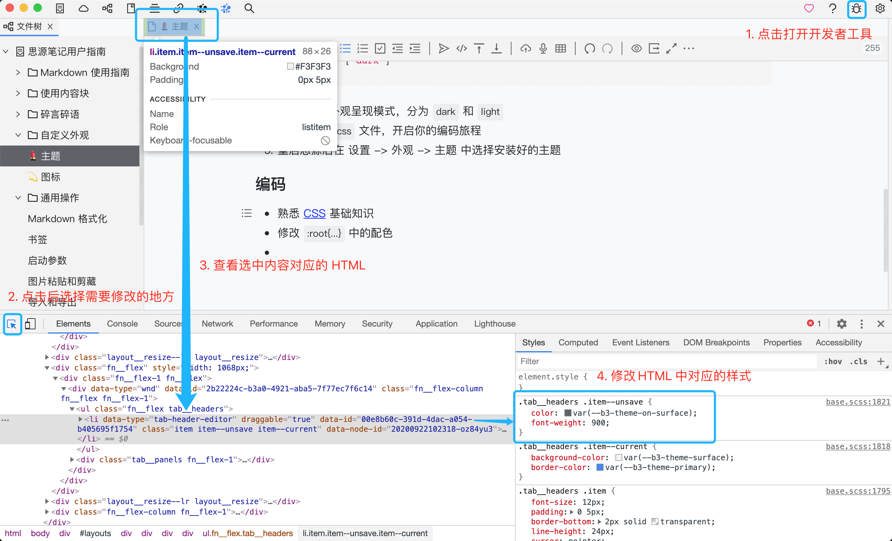
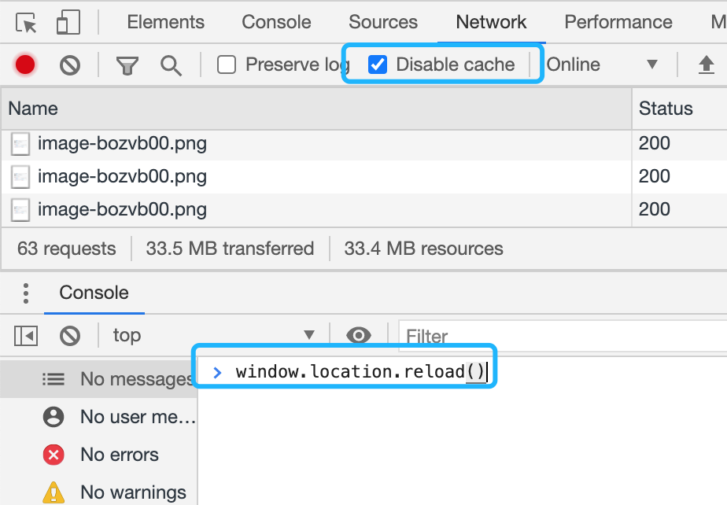

# Extend development

- Theme[^1] Sample project github repo: siyuan-note/theme-sample
- Icon[^2] Sample project github repo: siyuan-note/icon-sample
- Widget[^3] Sample project github repo: siyuan-note/widget-sample
- Plugin[^4] Sample project github repo: siyuan-note/plugin-sample
- Template[^5] Sample project github repo: siyuan-note/template-sample
- Marketplace github repo: siyuan-note/bazaar
- [Community Developer Resources](https://docs.siyuan-note.club/)

​#Note#:

- If plugins or external extensions require direct reading or writing of files under the `data` directory, please use the kernel API to achieve this. **Do not call** **​`fs`​** **or other electron or nodejs APIs directly**, as it may result in data loss during synchronization and cause damage to cloud data. Related APIs can be found at: `/api/file/*` (e.g., `/api/file/getFile`)
- When creating a daily note in SiYuan, a custom-dailynote-yyyymmdd attribute will be automatically added to the document to distinguish it from regular documents.

  > For more details, please refer to Github Issue #9807.
  >

  Developers should pay attention to the following when developing the functionality to manually create Daily Notes:

  - If `/api/filetree/createDailyNote` is called to create a daily note, the attribute will be automatically added to the document, and developers do not need to handle it separately
  - If a document is created manually by developer's code (e.g., using the `createDocWithMd` API to create a daily note), please manually add this attribute to the document

[^1]: # Theme

    ## Overview

    There are two ways to customize the theme:

    - Code snippet
    - Theme pack

    ## Code snippet

    1. Go to <kbd>Settings</kbd> - <kbd>Appearance</kbd> and click  <kbd>Code Snippet</kbd>, select CSS tab
    2. Input title
    3. According to the theme and the variables in theme.css, refer to the following writing method to encode and fill in the code snippet

        ```css
        html[data-light-theme="daylight"][data-theme-mode="light"] {
            --b3-theme-primary: red;
        }

        html[data-light-theme="daylight"][data-theme-mode="dark"] {
            --b3-theme-primary: blue;
        }
        ```
    4. Enable this code snippet
    5. Click the Confirm button

    ## Theme pack

    Theme packs can be downloaded from the community marketplace or installed manually.

    ### Community Marketplace

    - In <kbd>Settings</kbd> - <kbd>Appearance</kbd> - <kbd>Marketplace</kbd> - <kbd>Theme</kbd>, browse online themes contributed by community developers
    - Choose the required theme to install or update online

    ## Manual installation

    1. Get the theme from somewhere and unzip it
    2. <kbd>Settings</kbd> - <kbd>Appearance</kbd> - <kbd>Theme</kbd> - <kbd>Open the theme folder</kbd>
    3. Copy the theme to this folder
    4. Restart, select the desired theme in <kbd>Settings</kbd> - <kbd>Appearance</kbd> - <kbd>Theme</kbd>

    ## Development

    ### Step

    1. Give your subject a nice name, such as `alice`
    2. <kbd>Settings</kbd> - <kbd>Appearance</kbd> - <kbd>Theme</kbd> - <kbd>Open theme folder</kbd>
    3. Create a new folder `alice` in the opened folder, and create new `theme.css` and `theme.json` files in `alice`, for specific examples, please refer to github repo: siyuan-note/theme-sample
    4. Open the `theme.css` file to start your coding journey
    5. Restart, select the installed theme in <kbd>Settings</kbd> - <kbd>Appearance</kbd> - <kbd>Theme</kbd>

    ### Encoding

    - Familiar with [CSS](https://developer.mozilla.org/en-US/docs/Web/CSS) basic knowledge
    - Modify the color scheme in `:root{...}`. ⚠️ The variable items inherent in the official cannot be deleted
    - Continue to modify according to steps 1-4 in the figure  
      
    - Copy and paste the modified content into `theme.css` and save
    - Check the `Disable cache` in `Network` and run `window.location.reload()` to see the final result  
      

    ## Push to theme marketplace

    Please refer to [Community marketplace repo](https://b3log.org/siyuan/en/community.html).


[^2]: # Icon

    ## Overview

    Icon packs can be downloaded from the community marketplace or installed manually.

    ### Community Marketplace

    - Browse icons contributed by community developers online in <kbd>Settings</kbd> - <kbd>Appearance</kbd> - <kbd>Marketplace</kbd> - <kbd>Icons</kbd>​
    - Select the desired icon to install or update online

    ### Manual installation

    1. Get the icon and unzip
    2. <kbd>Settings</kbd> - <kbd>Appearance</kbd> - <kbd>Icon</kbd> - <kbd>Open Icon Folder</kbd>
    3. Copy the icon to this directory
    4. Restart, select the installed icon in <kbd>Settings</kbd> - <kbd>Appearance</kbd> - <kbd>Icon</kbd>

    ## Development

    ### Step

    1. Give your icon a nice name, such as `alice`
    2. <kbd>Settings</kbd> - <kbd>Appearance</kbd> - <kbd>Icon</kbd> - <kbd>Open Icon Folder</kbd>
    3. Create a new folder `alice` in the opened folder, and create new `icon.js` and `icon.json` files in `alice`, for specific examples, please refer to github repo: siyuan-note/icon-sample
    4. Open the `icon.js` file and paste the completed icon
    5. Restart, select the installed icon in <kbd>Settings</kbd> - <kbd>Appearance</kbd> - <kbd>Icon</kbd>

    ### Icon production

    - Use a browser to open the `index.html` file in the icon folder
    - Make similar icons based on the icon name and shape

      - Go to [Iconfont](https://www.iconfont.cn) to search for your favorite icon and download the SVG format
      - Use vector graphics tools to make your own icons in SVG format
      - Go to [pngtosvg](https://www.pngtosvg.com/) to convert the picture to SVG format
    - Go to [IcoMoon App](https://icomoon.io/app/#/select) to make `icon.js`​

      - Click on `Import Icons` in the upper right corner to import the pictures made in the previous step
      - Select the icon and generate SVG  
        
      - Modify the size and download  
        
      - Modify the `id` in `<symbol id="iconMarkdown" viewBox="0 0 32 32">` to the icon name corresponding to `index.html`​
      - Replace the content in `<defs>...</defs>` to the corresponding position in `icon.js`​
    - Test

      - Replace `material` in `index.html` with `alice`​

        ```html
        <script src="material/icon.js"></script>
        ```
      - Refresh `index.html` to see the final result
      - Open SiYuan and select the developed icon in <kbd>Settings</kbd> - <kbd>Appearance</kbd> - <kbd>Icon</kbd> to view

    ## Push to icon marketplace

    Please refer to [Community marketplace repo](https://b3log.org/siyuan/en/community.html).


[^3]: # Widgets

    ## Overview

    The widget is a static webpage served by SiYuan Kernel. It accesses data through API and renders it through `<iframe>`.

    Compared with plugins[^4], a widget is a kind of content block, which follows the indexing and rendering rules of the block. The widget is mainly oriented to content block extension, not to program function extension.

    ## How to use

    The widgets are installed through the widget marketplace. After installation, the widgets will be placed in the `workspace/widgets/` folder. In the editor, use the slash menu to trigger the call search. After selecting the widget you need, the widget will be inserted into the document in the form of a widget block.

    ## Push to widget marketplace

    Please refer to [Community marketplace repo](https://b3log.org/siyuan/en/community.html).


[^4]: # Plugins

    ## Overview

    Plugins are mainly used to expand the overall functions of SiYuan.

    Compared with Widget[^3], the plugin is mainly for program function extension, not for content block extension.

    ## How to use

    The plugin is installed through the plugin marketplace. After installation, the plugin will be placed in the folder `workspace/plugins/`. You can enable or disable plugins in <kbd>Settings</kbd> - <kbd>Marketplace</kbd> - <kbd>Downloaded</kbd> - <kbd>Plugin</kbd>.

    ## Push on plugin marketplace

    Please refer to [Community marketplace repo](https://b3log.org/siyuan/en/community.html).


[^5]: # Template snippet

    ## Overview

    The template snippet is used to quickly insert the previously set text content at the cursor caret position, and it supports variables. Template snippets use `.md` suffix files and are stored in the data/templates folder of the workspace.

    ## Writing a template

    The template is implemented using [The Go Programming Language text template](https://golang.org/pkg/text/template/). If you have an understanding of this, you can implement some program logic in it, such as comparison logic , Iterative logic, etc. In addition, to avoid syntax conflicts, template syntax uses `.action{action}` (instead of `{{action}}`).

    We have built-in variables and functions to enrich the template through the open source project Sprig (GitHub repo: Masterminds/sprig). For example, you can use `.action{now | date "2006-01-02 15:04:05"}` to render the current time. For more usage, please refer to [Sprig Function Documentation](http://masterminds.github.io/sprig/).

    There is a detail about the date and time formatting. #Note#: The formatting of the Go programming language is quite special: Instead of using `yyyy-MM-dd HH:mm:ss`, use `2006-01-02 15:04: 05` This fixed time format ([related discussions on Stack Overflow](https://stackoverflow.com/questions/20530327/origin-of-mon-jan-2-150405-mst-2006-in-golang)).

    In addition to the built-in variables and functions of Sprig, the following variables and functions are also supported:

    - ​`title`: Use this variable to insert the current document name. For example, if the template content is `# .action{.title}`, it will be inserted into the current document content with the first-level heading syntax after invoking
    - ​`id`：Use this variable to insert the current document id
    - ​`name`: Use this variable to insert the current document name
    - ​`alias`：Use this variable to insert the current document alias
    - ​`getHPathByID`: This function is used to return the readable path of the block corresponding to the block ID
    - ​`queryBlocks`: This function is used to query the database, and the return value is a list of blocks

      ```
      .action{$today := now | date "20060102150405"}
      .action{$blocks := queryBlocks "SELECT * FROM blocks WHERE content LIKE '?' AND updated > '?' LIMIT ?" "%foo%" $today "3"}
      ```
    - ​`getBlock`: This function is used to query the database based on the block ID, and the return value is block

      ```
      .action{getBlock "20250331163529-vixv1we"}
      ```
    - ​`querySpans`: This function is used to query the database, and the return value is a list of spans

      ```
       .action{querySpans "SELECT * FROM spans LIMIT ?" "3"}
      ```
    - ​`querySQL`: This function is used to query the database and the return value is a result set

      ```
       .action{querySQL "SELECT * FROM refs LIMIT 3"}
      ```
    - ​`statBlock`: This function is used to count the block content

      ```
      .action{ (statBlock .id).RuneCount} .action{ (statBlock .id).WordCount}
      ```
      - RuneCount
      - WordCount
      - LinkCount
      - ImageCount
      - RefCount
      - BlockCount
    - ​`runeCount`: This function is used to return the number of characters in a string
    - ​`wordCount`: This function is used to return the number of words in a string
    - ​`parseTime`: This function is used to parse a string in time format into a `time.Time` type so that more formatting methods can be used to render the time
    - ​`Weekday`: This function is used to return the day of the week `Sunday=0, Monday=1, ..., Saturday=6`​
    - ​`WeekdayCN`: This function is used to return the day of the week `Sunday=日, Monday=一, ..., Saturday=六`​
    - ​`WeekdayCN2`: This function is used to return the day of the week `Sunday=天, Monday=一, ..., Saturday=六`​
    - ​`ISOWeek`: This function is used to return the week
    - ​`pow`: Exponential calculation, return an integer
    - ​`powf`: Exponential calculation, return a floating point number
    - ​`log`: Logarithmic calculation, returns an integer
    - ​`logf`: Logarithmic calculation, return a floating point number

    ## Invoke template

    At the cursor caret position, select the template via <kbd>/</kbd> to trigger the template search, find the template that needs to be inserted and press <kbd>Enter</kbd>.

    ## An example

    ```plaintext
    .action{$before := (div (now.Sub (toDate "2006-01-02" "2020-02-19")).Hours 24)}

    .action{$after := (div ((toDate "2006-01-02" "2048-02-19").Sub now).Hours 24)}
    Today is `.action{now | date "2006-01-02"}`.

    * `.action{$before}` days have passed since `2020-02-19`
    * There are `.action{$after}` days left from `2048-02-19`
    ```
    `$before` and `$after` define two variables to record the number of days from the current date to 2020 and 2048, respectively.

    ## Push to template marketplace

    Please refer to [Community marketplace repo](https://b3log.org/siyuan/en/community.html).

    ‍
